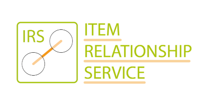

# 

[](https://github.com/eclipse-tractusx/item-relationship-service/blob/main/LICENSE)  
[](https://github.com/eclipse-tractusx/item-relationship-service/actions/workflows/irs-build.yml)
[](https://sonarcloud.io/summary/new_code?id=eclipse-tractusx_item-relationship-service)
[](https://github.com/eclipse-tractusx/item-relationship-service/actions/workflows/codeql.yml)  
[](https://github.com/eclipse-tractusx/item-relationship-service/actions/workflows/kics.yml)
[](https://github.com/eclipse-tractusx/item-relationship-service/actions/workflows/trivy.yml)
[](https://github.com/eclipse-tractusx/item-relationship-service/actions/workflows/veracode.yaml)
[](https://github.com/eclipse-tractusx/item-relationship-service/actions/workflows/owasp.yml)
[](https://github.com/eclipse-tractusx/item-relationship-service/actions/workflows/spotbugs.yml)
[](https://github.com/eclipse-tractusx/item-relationship-service/actions/workflows/eclipse-dash.yml)
[](https://github.com/catenax-ng/tx-item-relationship-service/actions/workflows/tavern.yml)   

## What is the IRS?

Within the [Catena-X network](https://catena-x.net/), the so-called Item Relationship Service (IRS) forms an essential 
foundation for various services and products. Within the Catena-X use cases, the IRS serves to increase business value.
For example, the IRS provides functionalities to serve requirements, such as occasion-based Traceability, 
from the Supply Chain Act. In doing so, IDSA and Gaia-X principles, such as data interoperability and sovereignty, are 
maintained on the Catena-X network and access to dispersed data is enabled. Data chains are established as a common asset.

With the help of the IRS, data chains are to be provided ad-hoc across n-tiers within the Catena-X network. 
To realize these data chains, the IRS relies on data models of the Traceability use case and provides the federated 
data chains to customers or applications. Furthermore, the target picture of the IRS includes the enablement of new 
business areas by means of data chains along the value chain in the automotive industry.

## Usage

### Local deployment

The following subsection provides instructions for running the infrastructure on docker-compose and the application in the IDE.

#### Docker-compose + IDE

- Start the necessary infrastructure by running `docker-compose up`

- Start the application from your favorite IDE. For IntelliJ, a run configuration is available in the .run folder.

#### Local IRS API

- Swagger UI: http://localhost:8080/api/swagger-ui
- API docs: http://localhost:8080/api/api-docs
- API docs in yaml:  http://localhost:8080/api/api-docs.yaml

### Local Helm deployment

#### Prerequisites

- install rancher desktop
- install kubectl
- Credentials for external environments in [helm charts](charts/irs-environments/local/values.yaml) can be found in
  IRS-KeePass
  - registry.registry.dockerSecret
  - edc.vault.hashicorp.token _(for provider and consumer data- and control-plane)_
  - irs-helm.keycloak.oauth2.clientId
  - irs-helm.keycloak.oauth2.clientSecret
  - irs-helm.keycloak.oauth2.clientTokenUri
  - irs-helm.keycloak.oauth2.jwkSetUri

#### How to run

- **Windows**  
  In CMD or PowerShell execute from project root: `.\charts\irs-environments\local\start.bat`  
  A new window will open to forward the ports to your local machine.
  Do not close this window until you want to stop the local deployment

- **Linux**  
  Run the following commands from project root  
  `./charts/irs-environments/local/start.sh`  
  `./charts/irs-environments/local/forward-ports.sh`(in a separate terminal tab or window, this needs to stay open)  
  `./charts/irs-environments/local/upload-testdata.sh`

IRS will be available at http://localhost:10165

#### How to stop

`helm uninstall irs-local -n product-traceability-irs`

### Accessing the secured API

A valid access token is required to access every IRS endpoint and must be included in the Authorization header -
otherwise **HTTP 401 Unauthorized** status is returned to the client.

The IRS uses the configured Keycloak server to validate access tokens. By default, this is the Catena-X INT Keycloak
instance. Get in contact with them to receive your client credentials.

To obtain an access token, you can use the
prepared [Postman collection](./testing/IRS%20DEMO%20Collection.postman_collection.json).

### Sample calls

Start a job for a globalAssetId:

```bash
curl -X 'POST' \
  'http://localhost:8080/irs/jobs' \
  -H 'accept: application/json' \
  -H 'Content-Type: application/json' \
  -H 'Authorization: Bearer <token_value>' \
  -d '{
  "aspects": [
    "SerialPartTypization"
  ],
  "bomLifecycle": "asBuilt",
  "depth": 1,
  "direction": "downward",
  "globalAssetId": "urn:uuid:8a61c8db-561e-4db0-84ec-a693fc5ffdf6"
}'
```

Retrieve the job results by using the jobId returned by the previous call:
```bash
curl -X 'GET' 'http://localhost:8080/irs/jobs/<jobID>' -H 'accept: application/json' -H 'Authorization: Bearer <token_value>'
```

## Documentation

- [Item Relationship Service Documentation](https://eclipse-tractusx.github.io/item-relationship-service/docs/)

## Licenses

Apache 2.0 (https://www.apache.org/licenses/LICENSE-2.0) - see [LICENSE](./LICENSE)

## Notice for Docker image
This application provides container images for demonstration purposes.

DockerHub: https://hub.docker.com/r/tractusx/irs-api

Eclipse Tractus-X product(s) installed within the image:

- GitHub: https://github.com/eclipse-tractusx/item-relationship-service
- Project home: https://projects.eclipse.org/projects/automotive.tractusx
- Dockerfile: https://github.com/eclipse-tractusx/item-relationship-service/blob/main/Dockerfile
- Project license: [Apache License, Version 2.0](https://github.com/eclipse-tractusx/item-relationship-service/blob/main/LICENSE)

**Used base image**
- [eclipse-temurin:19-jre-alpine](https://github.com/adoptium/containers)
- Official Eclipse Temurin DockerHub page: https://hub.docker.com/_/eclipse-temurin  
- Eclipse Temurin Project: https://projects.eclipse.org/projects/adoptium.temurin  
- Additional information about the Eclipse Temurin images: https://github.com/docker-library/repo-info/tree/master/repos/eclipse-temurin

As with all Docker images, these likely also contain other software which may be under other licenses (such as Bash, etc from the base distribution, along with any direct or indirect dependencies of the primary software being contained).

As for any pre-built image usage, it is the image user's responsibility to ensure that any use of this image complies with any relevant licenses for all software contained within.