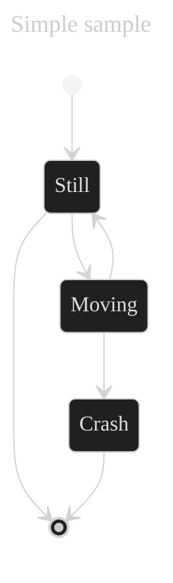

# Overview
# Problem Statement
SingleLevelBomAsBuilt 2.0.0 introduces a new property with boolean values called hasAlternatives.
The model now allows to reference items that are not available as AsBuilt Twins - e.g. Serial items or batches) but as AsPlanned twins.
Sometimes, however, it is not known what exact AsPlanned twin is needed to build the BoM asBuilt because there are different alternative twins to choose from.
In that case, all potential alternatives have to be referenced. To indicate that ambiguity the property "hasAlternative" has been added to the aspect model.
Property hasAlternative: Expresses weather the part is built-in or weather it is one of several options.

If the value is false, it can be assumed this exact part is built-in.
If the value is true, it is unknown weather this or an alternative part is built-in.

This is the case when, e.g. the same item is supplied by two suppliers, the item is only tracked by a customer part ID during assembly.
Thus, these items can not be differentiated from each other.

manufacturerId (BPN) of child items is now mandatory
Description of the main property 'SingleLevelBomAsBuild' was adapted to the new requirements of the model.

# Specification

| Artefact              | Version | Specification                                                                                                                                                                                                                                                                                                                                                                                                                                 |
|-----------------------|---------|-----------------------------------------------------------------------------------------------------------------------------------------------------------------------------------------------------------------------------------------------------------------------------------------------------------------------------------------------------------------------------------------------------------------------------------------------|
| Use Case              |         | Traceability                                                                                                                                                                                                                                                                                                                                                                                                                                  |
| BomLifecycle          |         | asPlanned & asBuilt                                                                                                                                                                                                                                                                                                                                                                                                                           |
| SingleLevelBomAsBuilt | 2.0.0   | [SingleLevelBomAsBuilt2.0.0](https://github.com/eclipse-tractusx/sldt-semantic-models/blob/main/io.catenax.single_level_bom_as_built/2.0.0/gen/SingleLevelBomAsBuilt.json)                                                                                                                                                                                                                                                                    |
| Propery hasAlternatives| boolean | Expresses wether the part is built-in or wether it is one of several options. If the value is false, it can be assumend this exact item is built-in. If the value is true, it is unknown wether this or an alternative item is built-in. This is the case when, e.g. the same item is supplied by two suppliers, the item is only tracked by a customer part ID during assembly. Thus, these items can not be differentiated from each other. |

|Precondition | Condition  |
|---|---|---|
| | hasAlternative = true| Unkown if part is built-in OR alternative part is built-in |
| | hasAlternative = false| exact part is built-in |

# Glossary
# Requirements
# Non functional requirements
# Concept
## Diagram/UML/ Key Visual/BPMN

# LOP
# Decision

