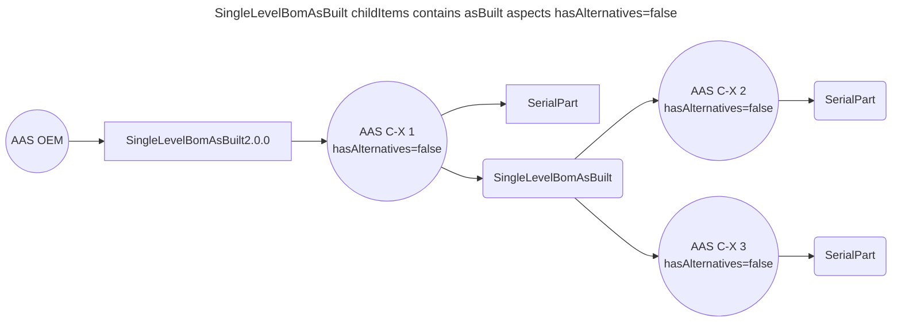
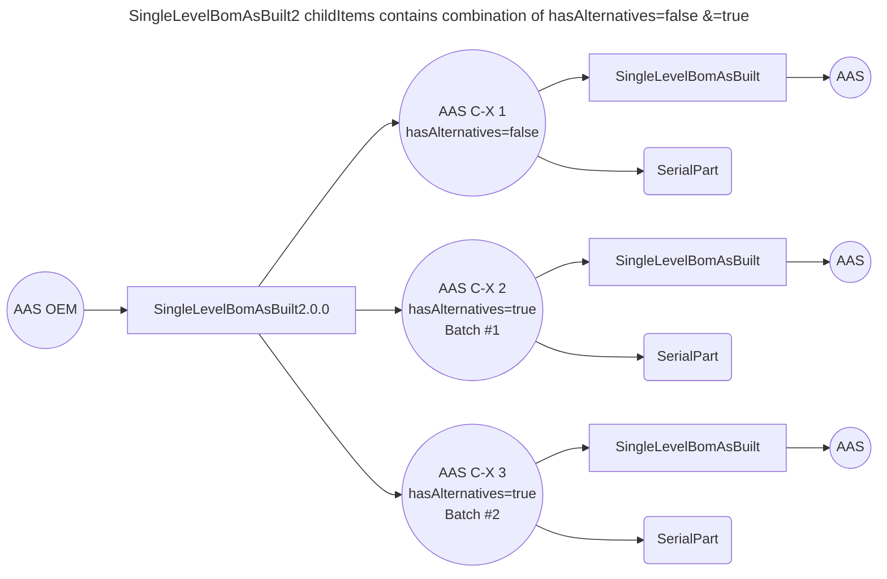

# Overview

# Problem Statement

SingleLevelBomAsBuilt 2.0.0 introduces a new boolean property `hasAlternatives`.
The model now allows to reference items that are not available as AsBuilt Twins - (e.g. Serial items or batches) but as AsPlanned twins.
Sometimes, however, it is not known what exact AsPlanned twin is needed to build the BoM asBuilt because there are different alternative twins to choose from.
In that case, all potential alternatives have to be referenced. To indicate that ambiguity, the property "hasAlternative" has been added to the aspect model.
Property hasAlternative: Expresses whether the part is built-in or whether it is one of several options.

If the value is false, it can be assumed this exact part is built-in.
If the value is true, it is unknown whether this or an alternative part is built-in.

This is the case when, e.g. the same item is supplied by two suppliers, the item is only tracked by a customer part ID during assembly.
Thus, these items can not be differentiated from each other.

manufacturerId (BPN) of child items is now mandatory
Description of the main property 'SingleLevelBomAsBuild' was adapted to the new requirements of the model.

# Specification

| Artefact                | Version | Specification                                                                                                                                                                                                                                                                                                                                                                                                                                    |
|-------------------------|---------|--------------------------------------------------------------------------------------------------------------------------------------------------------------------------------------------------------------------------------------------------------------------------------------------------------------------------------------------------------------------------------------------------------------------------------------------------|
| Use Case                |         | Traceability                                                                                                                                                                                                                                                                                                                                                                                                                                     |
| BomLifecycle            |         | asBuilt                                                                                                                                                                                                                                                                                                                                                                                                                                          |
| Use Cases               |         | CE, DPP, Trace-X (Traceability)                                                                                                                                                                                                                                                                                                                                                                                                                  |
| SingleLevelBomAsBuilt   | 2.0.0   | [SingleLevelBomAsBuilt2.0.0](https://github.com/eclipse-tractusx/sldt-semantic-models/blob/main/io.catenax.single_level_bom_as_built/2.0.0/gen/SingleLevelBomAsBuilt.json)                                                                                                                                                                                                                                                                       |
| Propery hasAlternatives | boolean | Expresses whether the part is built-in or whether it is one of several options. If the value is false, it can be assumend this exact item is built-in. If the value is true, it is unknown whether this or an alternative item is built-in. This is the case when, e.g. the same item is supplied by two suppliers, the item is only tracked by a customer part ID during assembly. Thus, these items can not be differentiated from each other. |

| Precondition           | Condition                                                  | 
|------------------------|------------------------------------------------------------|
| hasAlternative = true  | Unkown if part is built-in OR alternative part is built-in |
| hasAlternative = false | exact part is built-in                                     |

# Glossary

| Term            | Description                                                  |
|-----------------|--------------------------------------------------------------|
| (Part) Instance | Part Instance (twin) a concrete instance of a part - asBuilt |    
| (Part) Type     | Specification of a part (twin) - asPlanned                   |                   

# Assumption

* Property hasAlternatives is only added to SingleLevelBomAsBuilt aspect. Upstream relation will not be extended with property hasAlternatives.
* The property is only for the asBuilt Lifecycle and for no other lifecycles.
* The switch of BoMLifecyle is only unidirectional from asBuilt to asPlanned (no way back)
* Business apps and use cases do not have the requirement to continue traversing the asPlanned structure after switching. The return of the semantic models such as (PartAsPlanned) is sufficient.
* There is no option to group childItems in SingleLevelBomAsBuilt to a assembly. Each childItem is handled independent from each other. Part alternatives are not identifiable in the structure.
* The requestor (Trace-X) only wants to know the semantic models behind the part, but after a change of the BomLifecycle asPlanned, it does not want to continue traversing but only query the part information on the next level.
* If the complete structure of an asPlanned twin is required, the business app can initiate its own asPlanned oriented query for this parts tree via a separate query inside the irs

# Requirements

* [ ] IRS has the capability to switch bomLifeCyle (only for asBuilt) to provide asPlanned parts in a mixed stucture.

# Non functional requirements

# Concept

```json
"relationships": [
  {
    "catenaXId": "urn:uuid:d9bec1c6-e47c-4d18-ba41-0a5fe8b7f447",
        "linkedItem": {
            "assembledOn": "2022-02-03T14:48:54.709Z",
            "childCatenaXId": "urn:uuid:a45a2246-f6e1-42da-b47d-5c3b58ed62e9",
            "lastModifiedOn": "2022-02-03T14:48:54.709Z",
            "lifecycleContext": "<<LifeCyleContext>>", // If there is a change of BomLifecycle
            "quantity": {...},
            "alternative": "true" // <boolean> == hasAlternatices
            }
    }
],
```

| Change           | Description                                                                                        |
|------------------|----------------------------------------------------------------------------------------------------|
| lifecycleContext | Lifecycle context is adjusted to asPlanned or asBuilt in relation in case of a switch              |    
| alternative      | Reflects the state of property hasAlternative of item in SingleLevelBomAsBuilt chldItems structure |    

## SingleLevelBomAsBuilt childItems contains asBuilt aspects hasAlternatives=false

1. Normal case as IRS works as designed.
2. Traversal Aspect: SingleLevelBomAsBuilt
3. Semantic Aspects: Provisioning of bomLifeCycle asBuilt related semantic models (SerialPart, JustInSequence) according to job params "aspects":"[  ]"



## SingleLevelBomAsBuilt childItems contains asPlanned aspects hasAlternatives=false

1. IRS traversal using SingleLevelBomAsBuilt
2. Traversal Aspect: SingleLevelBomAsBuilt
3. In case all items of array childItems of aspect SingleLevelBomAsBuilt are set to hasAlternatives=true:  
   Provisioning of bomLifeCycle asBuilt related semantic models (SerialPart, JustInSequence) according to job params "aspects":[]  
   Provisioning of bomLifeCycle asPlanned related semantic models (PartAsPlanned, PartSiteInformation) according to job params "aspects":[]
4. IRS stops traversal on asPlanned (SingleLevelBomAsPlanned)
5. IRS continue traversal on asBuilt (SingleLevelBomAsBuilt)

### Flow

1. Endpoint POST /irs/job is executed with bomLifecycle=asBuilt and aspects of multiple bomLifecycle (SerialPart(asBuilt), PartasPlanned(asPlanned))
2. Traversal using SLBoMAsBuilt on all levels independent from property hasAlternatives
3. In case of switch to bomLifecycle asPlanned the semantic models are collected on next level. Traversal will be stopped.

```json 
{
  "aspects": [
    "SerialPart",
    "PartasPlanned"
  ],
  "bomLifecycle": "asBuilt",
  "callbackUrl": "https://hostname.com/callback?id={id}&state={state}",
  "collectAspects": true,
  "depth": 2,
  "direction": "downward",
  "key": {
    ...
  },
  "lookupBPNs": true
}
```

```mermaid
---
title: SingleLevelBomAsBuilt2 childItems contains asPlanned aspects hasAlternatives=false
---
flowchart LR
    s1((AAS C-X 1 \n hasAlternatives=true))
    s2((AAS C-X 2 \n hasAlternatives=true))
    s3((AAS C-X 3 \n hasAlternatives=true))
    SingleLevelBomAsBuilt[SingleLevelBomAsBuilt2.0.0]

    aas((AAS OEM)) --> SingleLevelBomAsBuilt
    SingleLevelBomAsBuilt --> s1
    SingleLevelBomAsBuilt --> s2
    SingleLevelBomAsBuilt --> s3
    
    s2 --> p1(PartAsPlanned)
    s3 --> p2(PartAsPlanned)
    s2 --> stop1((stop))
    s3 --> stop2((stop))
    
    s1 --> SingleLevelBomAsBuilt3[SingleLevelBomAsBuilt]
    SingleLevelBomAsBuilt3 --> s4((AAS C-X 4))
    
    classDef asPlanned fill: #9f6,stroke: #333, stroke-width: 2px;
    class s2,s3 asPlanned
    
    classDef stop1, stop2 fill: #fff, stroke: #333, stroke-width: 2px;
```

## SingleLevelBomAsBuilt childItems contains combination of asBuilt parts with mixture of hasAlternatives=false &=true

Case: Plastic granulate is used for the part. The "plastic granulate" batch cannot be assigned directly to the part, so several batches are assigned to the part.

1. IRS traversal using SingleLevelBomAsBuilt
2. Traversal Aspect: SingleLevelBomAsBuilt
3. In case all items of array childItems of aspect SingleLevelBomAsBuilt are set to hasAlternatives=true or false:  
   Provisioning of bomLifeCycle asBuilt related semantic models (SerialPart, JustInSequence) according to job params "aspects":[]
4. The traversing of the parts is carried out according to the traversing over the SingleLevelBomAsBuilt



# LOP

* [ ] Should the endpoint POST irs/jobs be extended by the default aspect PartAsPlanned? So that the interface can be called without specifying a parameter for "aspects"?

# Decision
 


