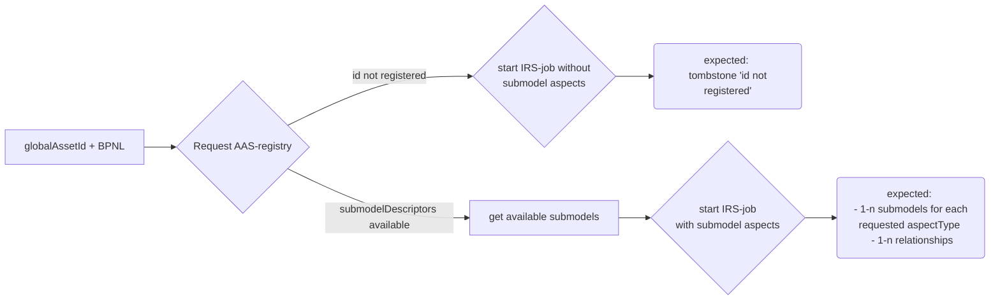

# Overview

# Brief summary

Previously tests were based on static data which were each one testdata file for asPlanned and asBuilt generated by TDG-team. Based on this files data provider registered their data.

In the future this approach will change and "dynamic data" will be available for the project. 

For conceptional work it is necessary to know what "dynamic data" means:

~~What is known and where to get the globalAssetId for IRS requests?~~ → globalAssetIds are given!
~~How to get information about the parts for specific globalAssetIds for test preparations?~~ → not possible to get them, tests have to be less concrete in expected data.
Who will provide configured testdata for e.g. ESS or other desired use cases?
~~How the data will be published and what will be published in concrete?~~ → not necessary to know since the globalAssetIds are given.

# Problem Statement

"Dynamic data" is not based on any testdataset and will be provided by data provider. As data consumer there is no information given about the data constellation in advance.

Following topics have to be testable with dynamic data as it was possible with static data:

* Use cases for **ESS** with expected and known **incident BPNS**. It is necessary to have known configured BPNS for desired expected test results.
* Use cases for **hops count** and **impacted supplier on first tier level** which has do be known to match the expected test results.
* Use cases for **submodels** for desired asset which have to be tested by expected data which has to be known.
* Use cases to check **relationships** for desired asset.
* Use cases for correct **tombstones** if e.g. the requested aspect is not available or for ESS validations.

# Assumption

# Requirements

# Non functional requirements

# Concept

## How to deal with "dynamic testdata" for regular IRS tests?
Since testable globalAssetIds with corresponding BPN is known the following details are unknown and have to be considered for the test design:

* **submodels** which can be requested for desired globalAssetId can be requested in the **AAS registry** (registry/.../shell-descriptors). The response contain a list of submodel descriptors. Therefore this has to be done first to figure out which aspects can be expected.
* Once the available submodels are known the request job for the test has to be adjusted with them. The **expectations** are following:
  * At least one submodel for each requested aspectType has to exist in the submodels array of job response.
  * If requested submodel is not existing → **tombstone** with failed SubmodelRequest have to exist.
  * **Relationships** have to exist.
  * If _lookupBPNs_ = _true_ → **bpns** have to contain at least one object
* To observe the performance topic the expected duration of jobs complete should be set dependent on the amount of requested aspects and the depth.

https://irs-aas-registry.dev.demo.catena-x.net/semantics/registry/api/v3.0/shell-descriptors

Hints:
* Concept for Tests scenario implementation requests for all AAS shells for a preconfigured dtr to be tested. (DTR are known in advance ) E2E test scenario could use multiple DTR registry to be tested.
* Concept for performance and duration issues the amount of AAS data used for testing could be configured for a specific environment (DEV, INT, STABLE, etc)
* Each AAS shell and the corresponding IRSJob is tested against a set of test scenarios (ESS, IRS up, IRS down) which contains a predefined set of constraints and conditions which ensures the quality and the correctness of IRS job and IRS JobResponses without knowing the concrete structure of the job.

## How to deal with "dynamic testdata" for IRS upward and downward tests?

## How to test ESS features with "dynamic testdata"?

ESS is currently tested with tavern tests which are based on a specific testdataset. This contains all necessary data for several usecases to test.

Those usecases include following topics:
* check for _supplyChainImpacted_ = Yes/No/Unknown
* check for _supplyChainhops_ which have to match the exact number of hops
* check for _supplyChainFirstLevelBpn_

Hints:
* For special use cases ESS where we expect an incident we use a pre known BPNS which is configurable within the test scenario

Hints:
* Basis set of constraints are defined and implemented in cucumber tests and could be extended later on.

# LOP

# Decision
