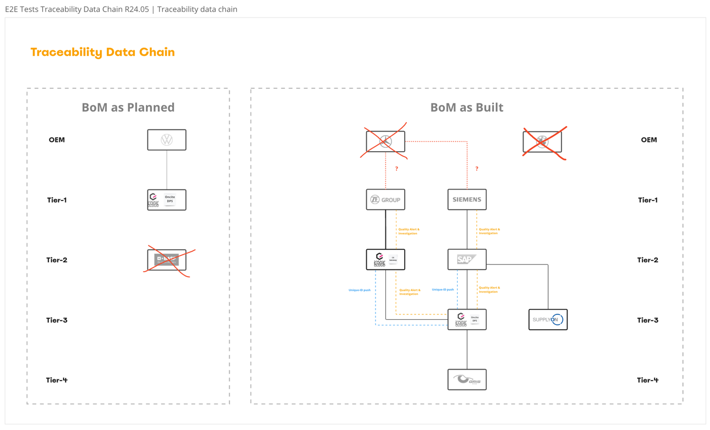

# Overview

# Brief summary
Previously tests were based on "static data" which were each one testdata file for asPlanned and asBuilt generated by TDG-team. Based on this files data provider registered their data.

In the future this approach will change and "dynamic data" will be available for the project.

For conceptional work it is necessary to know what "dynamic data" means:
* ~~What is known and where to get the globalAssetId for IRS requests?~~ → globalAssetIds are given for testing phases, but usually they are not known.
* ~~How to get information about the parts for specific globalAssetIds for test preparations?~~ → not possible to get them, tests have to be less concrete in expected data.
* Who will provide configured testdata for e.g. ESS or other desired use cases?
* ~~How the data will be published and what will be published in concrete?~~ → not necessary to know since the globalAssetIds are given.

# Problem Statement
"Dynamic data" is not based on any testdata set and will be provided by data provider continuously. As data consumer there is no information given about the data constellation in advance.
Actually the "dynamic data" approach does not even provide which globalAssetIds are registered, only the BPN of data provider is known.

Following use cases have to be testable with dynamic data as it was possible with static data:
* **submodels** for desired asset are correct
* check **relationships** for desired asset
* check correct **tombstones** for desired negative scenarios
* **ESS** with expected and known **incident BPNS**
* **hops count** and **impacted supplier on first tier level**
* ESS specific tombstone checks
* **DIL** features for integrity checks
* duration and load tests

# Assumption
Registered _globalAssetId_ and _BPN_ which can be used for tests are provided.

If *not*:
1. Request the digital twin registry with desired BPN of dataprovider to get a list of registered globalAssetIds.
   (https://irs-aas-registry.dev.demo.catena-x.net/semantics/registry/api/v3.0/lookup/shells?assetIds=[{"name":"manufacturerId","value":"BPNL0..."}],)

# Concept

## How to deal with "dynamic testdata" for IRS tests?
Since only testable globalAssetIds with corresponding BPN is known the following details are unknown and have to be considered for the test design:
* submodel aspects
* lifecycle
* direction
* depth

Usually there is no known data structure available but for test phases a [confluence page](https://confluence.catena-x.net/pages/viewpage.action?pageId=109655349) and [miro board](https://miro.com/app/board/uXjVMhz-WTw=/?moveToWidget=3458764572570470664&cot=10) are prepared.
This can be used to find out which data provider have registered data and what Tier-Levels can be expected. See e.g. miro board:



As test preparation first it is necessary to find out if the globalAssetId exists and the content of the shell:
1. First check if given globalAssetId is registered for desired BPN.
(https://irs-aas-registry.dev.demo.catena-x.net/semantics/registry/api/v3.0/shell-descriptors with header "Edc-Bpn"="BPN..." and check existence of globalAssetId) 
2. Next the DTR has to be requested with given globalAssetId to get the AAS-identifier.
(https://irs-aas-registry.dev.demo.catena-x.net/semantics/registry/api/v3.0/lookup/shells?assetIds=[{"name":"globalAssetId","value":"id"}])
3. After decoding the responsed AAS-identifier to base64 it is now possible to request the shell.
(https://irs-aas-registry.dev.demo.catena-x.net/semantics/registry/api/v3.0/shell-descriptors/dXJuOnV1aWQ6Nzg4ZGMxYmYtNmM5Yy00ZTliLWE0ODktN2UzY2Y5MzAyNzRi)


With the following design of testing no changes after data adjustments are necessary and maintenance efforts should be very low.
The cucumber implementation will have to be extended and adjusted to the new process. A cucumber scenario for positive test could be like the following:
```gherkin
"Request IRS-job and check if all desired submodels and relationships are given"
Given globalAssetId "urn:uuid..." is registered for BPN "BPN..."
        (request shell-descripors with BPN in header and check if globalAssetID is existing)
And get requestable job parameter
        (get submodels, lifecycle and direction from AAS-registry response)

When IRS job for globalAssetId "urn:uuid..." and BPN "BPN..." is registered
And with "all available" aspects
And with "valid" direction
And depth 10
And lookupBpns "true"
And collectAspects "true"
Then job-id is responsed
        
When job has changes to status "COMPLETED" within 20 minutes
Then job response contains "expected" amount of submodels
And job response contains "expected" amount of relationships
And "completed" jobs "exist" in "summary"
And "completed" jobs "exist" in "bpn-summary"        
And number of "tombstones" equals to "summary/asyncFetchedItems/failed"
```

### What submodel aspects can be requested?
**Submodels** which can be requested for desired globalAssetId can be found in the previous **AAS registry**. The response contain a list of submodel descriptors which can be found by _idShort_ in _submodelDescriptors_.
See example:
```json
{
	"description": [],
	"displayName": [],
	"globalAssetId": "urn:uuid:7e4541ea-bb0f-464c-8cb3-021abccbfaf5",
	"idShort": "EngineeringPlasticst",
	"id": "urn:uuid:297ffa5a-1478-4434-b315-ed8abdc65907",
	"specificAssetIds": [...],
	"submodelDescriptors": [
		{
			"endpoints": [...],
			"idShort": "SingleLevelUsageAsBuilt",
			"id": "urn:uuid:2ce52f97-b22a-48bd-82a5-633a23bade53",
			"semanticId": {
				"type": "ExternalReference",
				"keys": [
					{
						"type": "GlobalReference",
						"value": "urn:bamm:io.catenax.single_level_usage_as_built:2.0.0#SingleLevelUsageAsBuilt"
					}
				]
			},
			"supplementalSemanticId": [],
			"description": [],
			"displayName": []
		},
		{
			"endpoints": [...],
			"idShort": "Batch",
			"id": "urn:uuid:c7b3ea3d-97ea-41e4-960d-12fb166e1da1",
			"semanticId": {
				"type": "ExternalReference",
				"keys": [
					{
						"type": "GlobalReference",
						"value": "urn:samm:io.catenax.batch:2.0.0#Batch"
					}
				]
			},
			"supplementalSemanticId": [],
			"description": [],
			"displayName": []
		},
		{
			"endpoints": [
				{
					"interface": "SUBMODEL-3.0",
					"protocolInformation": {
						"href": "https://irs-provider-dataplane2.dev.demo.catena-x.net/api/public/data/urn:uuid:f43d9903-b44f-4a5f-8c91-beaee9f3c5b6",
						"endpointProtocol": "HTTP",
						"endpointProtocolVersion": [
							"1.1"
						],
						"subprotocol": "DSP",
						"subprotocolBody": "id=urn:uuid:5a6597fa-fa63-4b05-9db7-76718193339f;dspEndpoint=https://irs-provider-controlplane2.dev.demo.catena-x.net",
						"subprotocolBodyEncoding": "plain",
						"securityAttributes": [
							{
								"type": "NONE",
								"key": "NONE",
								"value": "NONE"
							}
						]
					}
				}
			],
			"idShort": "MaterialForRecycling",
			"id": "urn:uuid:f43d9903-b44f-4a5f-8c91-beaee9f3c5b6",
			"semanticId": {
				"type": "ExternalReference",
				"keys": [
					{
						"type": "GlobalReference",
						"value": "urn:bamm:io.catenax.material_for_recycling:1.1.0#MaterialForRecycling"
					}
				]
			},
			"supplementalSemanticId": [],
			"description": [],
			"displayName": []
		}
	]
}
```
Once the available submodels are known the request job for the test can be set. The **expectations** are following:
* At least one submodel for each requested aspectType has to exist in the submodels array of job response.


Hints:
* Concept for Tests scenario implementation requests for all AAS shells for a preconfigured dtr to be tested. (DTR are known in advance ) E2E test scenario could use multiple DTR registry to be tested.
* Each AAS shell and the corresponding IRSJob is tested against a set of test scenarios (ESS, IRS up, IRS down) which contains a predefined set of constraints and conditions which ensures the quality and the correctness of IRS job and IRS JobResponses without knowing the concrete structure of the job.

### What job parameter can be set and expected?
* Jobs with requested submodels have to contain **Relationships**.
* If _lookupBPNs_ = _true_ → **bpns** have to contain at least one object.
* If _lookupBPNs_ = _false_ → **bpns** have to be empty.


### Which lifecycle does the globalAssetId belongs to?
Lifecycle is decided based on submodel-aspects:

| submodel-aspect | Lifecycle   |
|-----------------|-------------|
| SingleLevelBomAsBuilt<br/>SingleLevelUsageAsBuilt | asBuilt     |    
| SingleLevelBomAsPlanned<br/>SingleLevelUsageAsPlanned | asPlanned   |   
| SingleLevelBomAsSpecified | asSpecified |   


### Which direction have to be requested, upward or downward?
Direction is decided based on the given submodel-aspects:

| submodel-aspect | Direction   |
|-----------------|-------------|
| SingleLevelBomAsBuilt<br/>SingleLevelBomAsPlanned<br/>SingleLevelBomAsSpecified | downward     |    
| SingleLevelUsageAsBuilt | upward |


### What depth can be expected?
Currently, there is no effective way to find out the depth of desired globalAssetId. Decided could be the following:
* IRS tests are requested with depth = 10
* Load tests will be run with depth > 50


## Testing tombstones with negative scenarios.
Tombstones can be tested based on available information for following scenarios:
* If requested globalAssetId in the AAS-registry is not known -> **tombstone** 500 for DigitalTwinRequest
* If requested submodel is not existing → **tombstone** with failed SubmodelRequest
* For all tests -> failed asyncFetchedItems = amount of tombstones


## How to test ESS features?
ESS is currently tested with tavern tests which are based on a specific testdata set. This contains all necessary data for several use cases to test.

Those use cases include following topics:
* check for _supplyChainImpacted_ = Yes/No/Unknown
* check for _supplyChainhops_ which have to match the exact number of hops
* check for _supplyChainFirstLevelBpn_

For now, it is not possible to check all relevant use cases without known testdata set. 
Specific data constellations for the desired investigation cases have to be predesigned and shall not change.

Hints:
* For special use cases ESS where we expect an incident we use a pre known BPNS which is configurable within the test scenario

## How to test DIL features?
The DIL features are not merged to main and still located on a feature branch. Successful executions can only be done on an own application on DEV.
Same as for ESS features the DIL-tests are based on a specific testdata set which contains data constellations to reproduce all implemented use cases.

Therefore, it has to be discussed if a test approach for DIL-features with dynamic data is necessary and relevant at all.

## How to run duration and load tests with "dynamic testdata"?
Current cucumber tests have already a timeout step in use to wait for the job to COMPLETE within a given time. This can be adjusted for each test.

The load test is set up as one request which is requested a given amount of times. For this the given globalAssetId + BPN can be set.
The test can be adjusted with more aspects and higher _depth_ but this is not dependent on kind of data provision.

Hints:
* Concept for performance and duration issues the amount of AAS data used for testing could be configured for a specific environment (DEV, INT, STABLE, etc.)
* Basis set of constraints are defined and implemented in cucumber tests and could be extended later on.


# LOP

# Decision