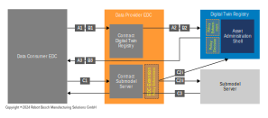

# \[Concept\] \[#ID#\] Summary

| Key           | Value                                                                           |
|---------------|---------------------------------------------------------------------------------|
| Creation date | 14.03.2024                                                                      |
| Ticket Id     | [#438](https://github.com/eclipse-tractusx/item-relationship-service/issues/438) |    
| State         | WIP                                                                | 

## Table of Contents

1. [Overview](#overview)
2. [Summary](#summary)
4. [Assessment](#assessment)
9. [Glossary](#glossary)
10. [References](#references)

## Overview
The goal of this concept is to determine the impact on the IRS resulting from the new EDC extension "Policy Enforcement". 
To this end, the API and the necessary changes to the IRS must be determined, documented and, if necessary, issues derived from them.

## Summary
Extension of reference implementation of Digital Twin Registry (DTR) in Catena-X for scalable access management to Asset Administration Shells (AAS) and adhering Submodel server(s).

## Assessment

- IRS uses the EDC for any request to the dDTR and Submodel Server 

### Request Sequence (A) to API /lookup/shells

**(1.) Data request from consumer EDC to provider EDC (A1)**
The API /lookup/shells is used in IRS. IRS used the globalAssetId to filter for a specific asset. The BPNL is injected to DTR request header via the EDC and the credential stored in the MIW. 
This will work as intended.
**specificAssetIds** is not used by the IRS for filter for AAS assets.

**(2.) API request by consumer EDC to DTR via provider EDC (A2)**
**(3.) DTR receives request and sends response to consumer EDC (A3)**
Communication only between the participants EDC and the DTR. The BPNL is injected into the request header of the dDTR by the EDC.

[x] No impact on IRS

### Request Sequence (B) to API /shell-descriptors/{aasIdentifier}

**(1.) Data request from consumer EDC to provider EDC (B1)**
**(2.) API request by consumer EDC to DTR via provider EDC (B2)**
**(3.) DTR receives request and sends response to consumer EDC (B3)**
Communication only between the participants EDC and the DTR. The BPNL is injected into the request header of the dDTR by the EDC.

[x] No impact on IRS

### Request Sequence (C) to Submodel Server

**(1.) Data request from consumer EDC to provider EDC (C1)**
**(2.) API request by consumer EDC to DTR for check on access (C2i)**
Communication only between the participants EDC and the DTR. The BPNL is injected into the request header of the dDTR by the EDC.

[x] No impact on IRS 

### An additional API (outside the definition of the asset administration shells) is required to manage access rules.
Only required for data providers. 

[x] No impact on IRS

### Impact: 

Outlines the impact of the proposed solution, including the need for an EDC extension, additional APIs in the DTR, and the benefits to data providers utilizing this access management approach. 
For the IRS as a data consumer there seem to be no impact and no changes required. 

## Conclusion
No scalable access to attributes is required on the part of the irs. This is the responsibility of data providers such as bps. Trace-X. IRS uses the globalAssetIds to search for assets. For this reason, no dependency on the concept could be determined.  
No impact on data consumers. 

### AAS_Access_v3_Architecture

## Glossary

| Abbreviation | Name                      |
|--------------|---------------------------|
| CRUD             | Create Read Update Delete |
| MIW             | Managed Identity Wallet  |
| AAS | Asset Adminstration Shell | 

## References
- [Concept of CRUD API for Access management APIs](https://github.com/eclipse-tractusx/sldt-digital-twin-registry/issues/291)
- [Implementation for Access management to Digital Twins (via EDC extension)](https://github.com/eclipse-tractusx/sig-release/issues/417)
- [EDC-based Access Control for Asset Administration Shells and Submodel Server](https://github.com/eclipse-tractusx/sig-release/issues/417#issuecomment-1883058762)