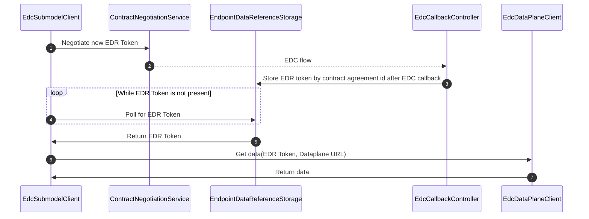
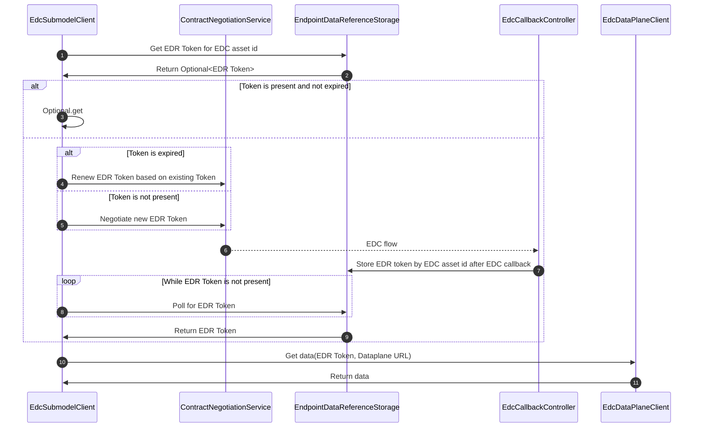
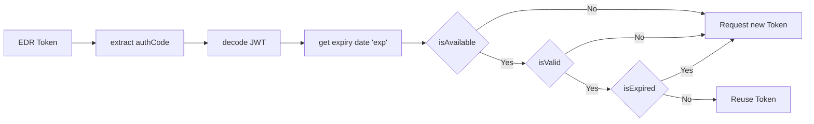
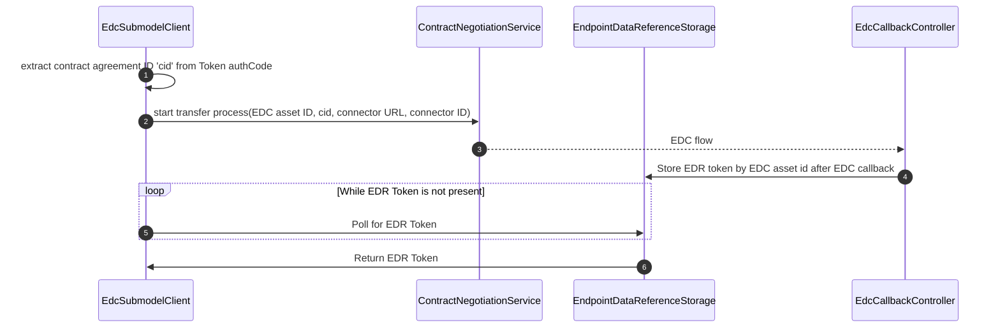

# \[Concept\] \[TRI-1604\] EDC EDR Token negotiation and usage

## Glossary

| Abbreviation | Name                         |
|--------------|------------------------------|
| EDR          | EndpointDataReference        |
| EDR-Storage  | EndpointDataReferenceStorage |

## Existing flow - single use token

The existing flow of token negotiation and usage only allows to use a negotiated contract and the resulting EDR (
Endpoint Data Reference) Token to be used once.
After the token is consumed, it is removed from the EDR-Storage (EndpointDataReferenceStorage).

## New flow - reuse token

To increase performance for assets with the same EDC contract, IRS should be able to reuse an existing EDR token.

To make this possible, two things have to be adjusted.

1. IRS has to check first, if an EDR Token for the requested EDC Asset ID is available in EDR-Storage
2. EDR Tokens have to be stored in the EDR-Storage with the EDC Asset ID as key instead of contract agreement id

### Case: Token already present in EDR-Storage

### Case: Token is expired

