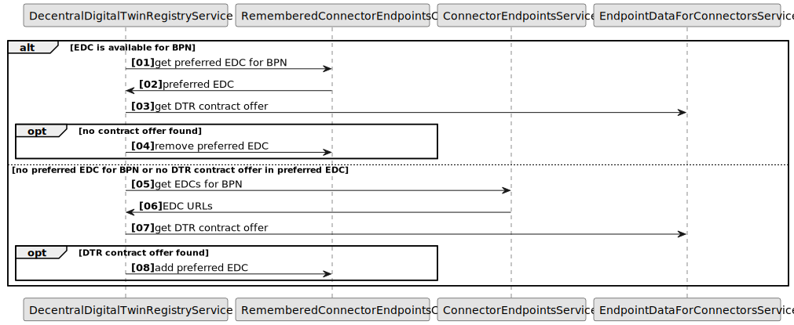

## Context and Problem Statement

Currently, the IRS queries all known EDC endpoints to find a valid DTR contract offer for each request. Since the EDC which contains the DTR contract offer usually stays the same, this process is inefficient and causes unnecessary load, especially for frequently requested BPNs. After a successful query, the IRS does not remember which EDC provided the offer, leading to repeated queries against multiple EDCs.

Goal: Reduce repeated broad queries by "remembering" which EDC successfully provided a DTR contract offer for a given BPN, and use that remembered EDC first in subsequent requests.

## Decision

Store the last EDC endpoint, where the DTR Negotiation was successful, for each BPN in a thread-safe, in-memory cache. For subsequent requests of the same BPN, first attempt the remembered EDC. If it still provides the needed DTR offer, return immediately. If not, remove it from the cache, query all EDCs again, and update the memory with the new successful EDC.

The storage should have the be possibility to disable by a feature flag.

Initialization and configuration has to be possible by users of the irs-edc-client package (e.g. like AcceptedPoliciesProvider).

## Rationale

- Simplicity: An in-memory map keyed by BPN with EDC endpoint as the value is easy to implement.

- Performance: Directly accessing a remembered EDC reduces overhead. No network I/O is needed for this lookup.

- No Persistence Required: IRS is not expected to restart frequently. This does not require storage across restarts, simplifying the design.

- Limited Scale: With only up to a few thousand potential BPNs, memory usage and lookup times remain negligible.

- Concurrency: A concurrent data structure can ensure all IRS threads share and safely update the cache.

## Considered Alternatives

- No Caching (Status Quo):

  - Continue querying all EDCs for every request.
  - Drawback: High overhead, no efficiency improvement.

- Static Configuration of EDCs per BPN:
  - Manually configure a mapping.
  - Drawback: Requires maintenance and fails to adapt dynamically as offers change.

- Persistent Database Store:
  - Store BPN-to-EDC mappings in a database. 
  - Drawback: Increases complexity and overhead, and not required since persistence across restarts is not required.

- Distributed Caching (e.g., Redis):
  - For a single application instance, unnecessary complexity. 
  - Drawback: Additional infrastructure and complexity.

The chosen in-memory approach balances simplicity and performance. If requirements evolve (e.g., multiple instances), a distributed cache could be revisited.

## Positive Consequences

- Speed: Frequently accessed BPNs are resolved quickly from memory.

- Reduced Log Noise: Fewer unnecessary queries against irrelevant EDCs.

- Minimal Maintenance: No configuration required; memory updates dynamically.

## Additional Considerations

To reduce load on the EDC Catalog even further, Catalog responses can be cached to be reused in the future.

This is especially useful for recurring requests, like the DTR contract offer. In combination with the EdcOrchestrator, load to the EDC can be minimized.