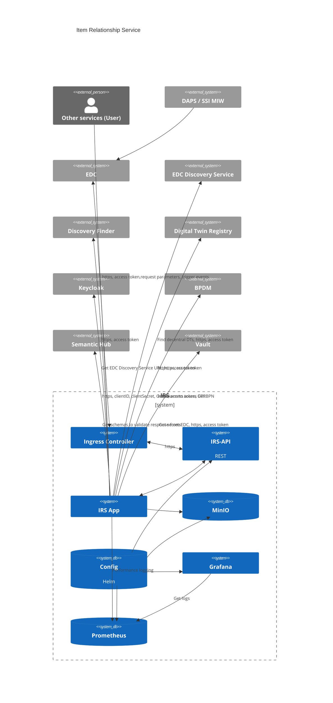

# Security Assessment

**Assumption**: There is no central IRS catena-x service - IRS is meant to be run within one company. This assumption is crucial for this security assessment, because it reduces the attack surface significantly.

